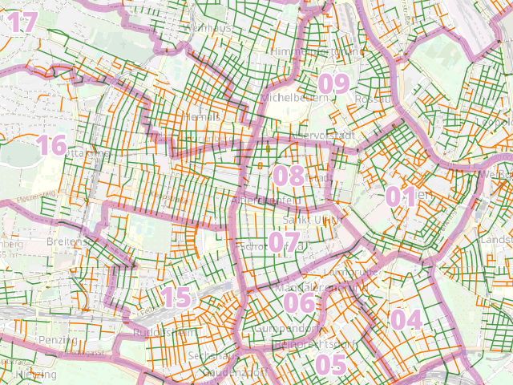

# Oneway Analysis (Contraflow cycling)

**Goal:** analyze the length of oneways in minor / residental roads
(not) opened for cyclists. Compare results between districts.

We use data from [OpenStreetMap](https://www.openstreetmap.org) as well as open government data (OGD). All geospatial processing is done in [QGIS](https://qgis.org)

For results see https://www.radlobby.at/wien/einbahnen



## Conventions & Limitations

- **Cycleways next to roads:** Oneways that are *not opened* for cycling but have a cycleway next to them *count as opened*.
  - In case the cycleway itself is a oneway in the same driving direction we wrongly count it as opened.
- **Separated driving lanes**
  - Roads with separated driving lanes per direction (or roads that were at least mapped like that) are not "real" oneways for the purpose of our analysis and are therefore omitted, i.e. not counted as oneways.
- **Short parts of oneways next to cycleways count as opened:** our buffering of cycleways sligthly changes the statistics because oneways leading to/from a cycleway always count as opened for the first few meters. The total error should be negligible though.
- **Access restrictions are not respected:** The analysis may contain roads where cycling / driving is forbidden (we don't yet take access restrictions into account). The number of roads where this is the case is very low.
- **Note regarding the 2022 dataset:** Some residential roads around the new metro station Frankhplatz are used as detour and were tagged as major roads in OSM. We still included them in the analysis.
- **Note regarding the 2025 dataset:** Vienna now provides good coverage of the `dual_carriageway` attribute (saving a lot of manual work to remove false positives)


## Data Acquisition

1. Download [boundaries of Vienna's districts](https://www.data.gv.at/katalog/dataset/stadt-wien_bezirksgrenzenwien) and add a new field `district` (e.g. copy the field `BEZ`)

2. Download the OpenStreetMap road network from [one of these sources](https://planet.osm.org/) or as a fallback solution from [Overpass Turbo](https://overpass-turbo.eu):

    ```
    way
    [highway]
    ({{bbox}});
    (._;>;);
    out;
    ```

3. Roughly extract Vienna and convert the OSM file to geopackage with `ogr2ogr`

    ```bash
    osmium extract -b 16.18,48.11,16.58,48.33 austria-latest.osm.pbf -o vienna-latest.osm.pbf
    OSM_CONFIG_FILE=osmconf_custom.ini ogr2ogr -f GPKG vienna-latest.gpkg vienna-latest.osm.pbf
    ```

    The custom `.ini` makes sure that all relevant tags are kept.

4. Download open government data for opened oneways - choose whatever was updated more recently (unfortunately updates seem to be irregular):
   - [Radfahranlagen Wien](https://www.data.gv.at/katalog/dataset/5e6175cd-dc44-4b32-a64a-1ac4239a6e4a) (use the layer source filter `"SUBMERKMAL" = 'Radfahren gegen die Einbahn'`)
   - [Radfahren gegen die Einbahn Wien](https://www.data.gv.at/katalog/dataset/radfahren-gegen-die-einbahn-wien)


## Data Processing

Use the QGIS Processing model `contraflow-cycling.model3`

The model goes through all of these steps:

### Basic Preparations

1. Load the district boundaries and `Reproject` to EPSG:31256
2. Load the *lines* layer of the OSM file
3. Add the layer source filter `"highway" IS NOT NULL`
4. `Reproject` to EPSG:31256
5. `Intersection` of the OSM ways with districts (only keep the `BEZ` field for the district layer)
6. Rename the field `BEZ` to `district`


### Filter Minor Roads

Filter small roads, but not too small so we don't include e.g. parking lots.
We don't include living streets and pedestrian zones with the exception of *Begegnungszonen*.

```
"highway" IN ('unclassified', 'residential') OR
"traffic_sign" LIKE 'AT:53.9e%' OR "traffic_sign" = 'AT:§53.9e'
```


### Mark Roads With Parallel Cycleways

Oneway roads with a cycleway right next to it are treaded as a special case.

1. Filter cycleways with this layer source filter:

    ```
    "highway" = 'cycleway' OR
    ("highway" = 'footway' AND "bicycle" = 'designated') OR
    ("highway" = 'path' AND "bicycle" = 'designated')
    ```

2. `Buffer` (but don't dissolve to save time in the following steps) by 15m

3. `Clip` minor roads with buffered cycleways, add new attribute `cycleway_within_15m=true`, remove attribute `fid`

4. `Difference` minor roads with buffered cycleways, add new attribute `cycleway_within_15m=false`, remove attribute `fid`

5. `Merge vector layers` of the results of *clip* and *difference*


### Determine Opened / Closed Oneways

Calculate these attributes using the `Field Calculator`.

- `length_m`:

    ```
    round($length)
    ```

- `oneway_type`:

    ```
    case
    when dual_carriageway='yes' then 'no_oneway'
    when junction='roundabout' then 'no_oneway'
    when oneway='yes' and (
            ("oneway_bicycle" is null or "oneway_bicycle" != 'no') and
            ("cycleway" is null or "cycleway" not like 'opposite%') and
            ("cycleway_left" is null or "cycleway_left" not like 'opposite%') and
            ("cycleway_right" is null or "cycleway_right" not like 'opposite%') and
            ("cycleway_both" is null or "cycleway_both" not like 'opposite%') and
            ("cycleway_within_15m" is null or "cycleway_within_15m" = false)
        )
    then 'oneway_closed'
    when "oneway" = 'yes' and (
            "oneway_bicycle" = 'no' or
            "cycleway" like 'opposite%' or
            "cycleway_left" like 'opposite%' or
            "cycleway_right" like 'opposite%' or
            "cycleway_both" like 'opposite%' or
            "cycleway_within_15m" = true
        )
    then 'oneway_opened'
    else 'no_oneway'
    end
    ```

### Statistics

Calculate `Statistics by Categories` on the field `length_m` with the fields `district` and `oneway_type` as categories.


## Quality Assurance

To double-check completeness and correctness of OpenStreetMap data we use the cycle infrastructure OGD with the following layer source filter: `"SUBMERKMAL" = 'Radfahren gegen die Einbahn'`

Use the QGIS Processing model `contraflow-cycling-qa.model3` to detect potential errors.

Deviations between OSM and OGD are then checked manually with the help of cyclists with local knowledge.
